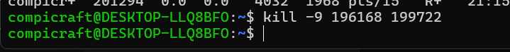

# Homework 2

## Task 1:
Hazelcast та Management Center скачав з посилання яке було в завданні
## Task 2:
Ноди запускав у wsl, відкрив паралельно три термінали, отримав кластер з трьох учасників

## Task 3:
З допомогою коду у task3.py під'єднався як кліент до кластера та заповнив даними. Розподіл даних між нодами

Ситуація після відключення однієї ноди:

Ситуація після відключення двох нод послідовно:

Після двох нод одночасно

Є втрата даних. Для запобігання цього можна використати різні механізми реплікації та відновлення даних за рахунок бекапів
## Task 4:
Запустив паралельно збільшення одного значення використовуючи потоки  

 
Багато даних "губиться" через race condition
## Task 5:
Результат  

## Task 6:
Результат  

## Task 7:
З блокування дійсно зникає race condition. По швидкості виконання обидва способи у мене фактично одинакові з скріншотів вище
## Task 8:
Результати  

Вичитування відбувається непослідовно
Якщо забрати читачів, то черга просто заповниться до 10-ти і стане в очікування  
